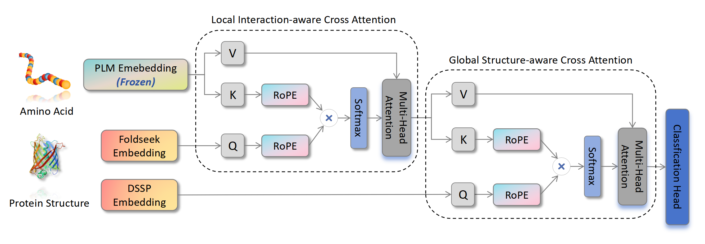

# Simple, Efficient and Scalable Structure-aware Adapter Boosts Protein Language Models

## 🚀 Introduction (SES-Adapter)

SES-Adapter, a simple, efficient, and scalable adapter method for enhancing the representation learning of protein language models (PLMs). 

We serialized the protein structure and performed cross-modal-attention with PLM embeddings, effectively improving downstream task performance and convergence efficiency.



## 📑 Results

### News

- [2024.07.08] We have added the ESM3 structure tokenizer in `data/get_esm3_structure_seq.py`, you should download the checkpoint from [ESM3 huggingface](https://huggingface.co/EvolutionaryScale/esm3-sm-open-v1/tree/main/data/weights).

### Paper Results

We conduct evaluation on 9 state-of-the-art baseline models (**ESM2, ProtBert, ProtT5, Ankh**) across 9 datasets under 4 tasks (**Localization, Function, Solubility, Annotation**).

Results show that compared to vanilla PLMs, SES-Adapter improves downstream task performance by a maximum of **11%** and an average of **3%**, with significantly accelerated training speed by a maximum of **1034%** and an average of **362%,** the convergence rate is also improved by approximately **2** times.

## 🛫 Requirement

### Conda Enviroment

Please make sure you have installed **[Anaconda3](https://www.anaconda.com/download)** or **[Miniconda3](https://docs.conda.io/projects/miniconda/en/latest/)**.

```
conda env create -f environment.yaml
conda activate ses_adapter
```

### Hardware

We recommend a **24GB** RTX 3090 or better, but it mainly depends on which PLM you choose.

## 🧬 Start with SES-Adapter

### Dataset Formation

We provide datasets and format references in the `dataset` folder. We support both `JSON` and `CSV` data formats.

- JSON:
  - example: https://github.com/tyang816/SES-Adapter/tree/main/dataset/BP
  - For more JSON dataset, you can found in [dataset](https://github.com/tyang816/SES-Adapter/tree/main/dataset).
- CSV example:
  - example: https://huggingface.co/datasets/tyang816/DeepLocBinary_AlphaFold2
  - For more CSV dataset, you can found in [huggingface](https://huggingface.co/tyang816).

**Config** file should be specified ahead.

- JSON config file [example](https://github.com/tyang816/SES-Adapter/blob/main/dataset/BP/BP_AlphaFold2.json). 
- CSV config file [example](https://github.com/tyang816/SES-Adapter/blob/main/dataset/BP/BP_AlphaFold2_HF.json).

```
{
    "dataset": "BP", # Huggingface: tyang816/BP_AlphaFold2
    "pdb_type": "AlphaFold2",
    "train_file": "dataset/BP/AlphaFold2/train.json", # no need for Huggingface
    "valid_file": "dataset/BP/AlphaFold2/valid.json", # no need for Huggingface
    "test_file": "dataset/BP/AlphaFold2/test.json", # no need for Huggingface
    "num_labels": 1943,
    "problem_type": "multi_label_classification",
    "metrics": "f1_max",  # for multiple metrics use ',' to split, example: "accuracy,recall,precision"
    "monitor": "f1_max",
    "normalize": "None"
}
```

### Metrics Support

| Metric Name   | Full Name        | Problem Type                                            |
| ------------- | ---------------- | ------------------------------------------------------- |
| accuracy      | Accuracy         | single_label_classification/ multi_label_classification |
| recall        | Recall           | single_label_classification/ multi_label_classification |
| precision     | Precision        | single_label_classification/ multi_label_classification |
| f1            | F1Score          | single_label_classification/ multi_label_classification |
| mcc           | MatthewsCorrCoef | single_label_classification/ multi_label_classification |
| auc           | AUROC            | single_label_classification/ multi_label_classification |
| f1_max        | F1ScoreMax       | multi_label_classification                              |
| spearman_corr | SpearmanCorrCoef | regression                                              |

### Train

See the `train.py` script for training details. Examples can be found in `scripts` folder.

## 🙌 Citation

Please cite our work if you have used our code or data.

```
@article{tan2024ses-adapter,
  title={Simple, Efficient and Scalable Structure-aware Adapter Boosts Protein Language Models},
  author={Tan, Yang and Li, Mingchen and Zhou, Bingxin and Zhong, Bozitao and Zheng, Lirong and Tan, Pan and Zhou, Ziyi and Yu, Huiqun and Fan, Guisheng and Hong, Liang},
  journal={arXiv preprint arXiv:2404.14850},
  year={2024}
}
```

